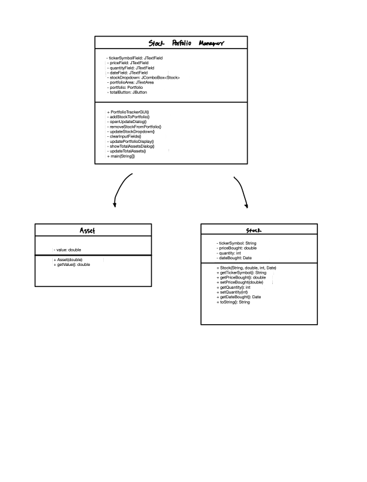

# -Stock-Portfolio-Manager

# Project Name: Stock Portfolio 

# Manager Team Name: Portfolio Technologies 

# Team Member(s): Sam Jung

Abstract:
The Stock Portfolio Manager is designed to be a no-cost, user-friendly application that gives investors the ability to efficiently manage their stock investments. The primary objective behind building this application is to create a tool that simplifies the process of tracking one’s portfolio performance, making informed investment decisions, and staying updated with real-time market data.

The application will be accessed through a graphical user interface (GUI), where users can interact with various features such as adding new stocks, updating stock prices, removing stocks, and viewing the total value of their portfolio.

Plan:
The project plan for the Stock Portfolio Manager involves defining scope and requirements, designing the user interface, setting up the development environment, implementing core functionality such as stock and portfolio management, creating GUI components, integrating real-time data (optional), adding features like performance analysis and alerts, testing, documentation, deployment, gathering user feedback, and iterating based on it. This will be done over a twelve-week timeline, with tasks distributed across each phase, ensuring systematic development, thorough testing, user engagement, and continuous improvement of the application.

